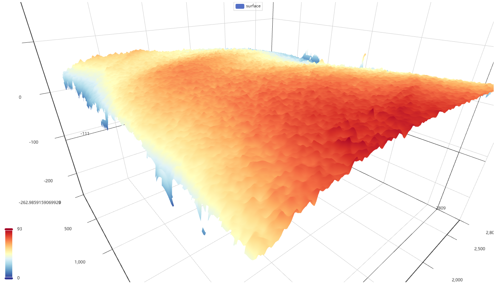
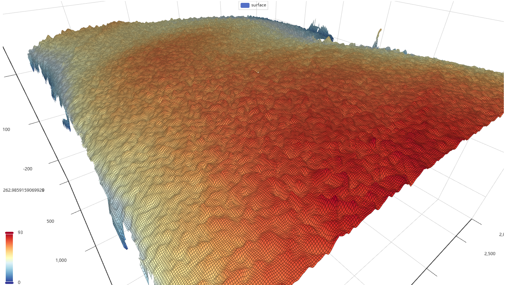

# 板件三维形貌可视化工具

## 概述

输入数据示例：

```
84191.440649 32138.791774 12998.085469
85397.299668 32138.791774 13003.696688
85400.815292 32138.791774 13004.301116
85404.330916 32138.791774 13004.624285
85407.846540 32138.791774 13004.982844
85411.362164 32138.791774 13005.219400
85414.877788 32138.791774 13005.609624
85418.393412 32138.791774 13004.716486
85421.909036 32138.791774 13004.713692
```

可输出一个网页文件，包含一个三维形貌的可视化界面，如下图所示：

- 不显示线框：



- 显示线框：



## 使用说明

这是一个命令行执行的工具，请在命令行执行以下指令。

### 1. 拉取项目代码

+ git clone
+ download zip

### 2. 安装依赖

```bash
pip install -r requirements.txt
```

### 3. 运行程序

在程序运行时，将待处理的数据文件作为运行参数传入，支持多个文件同时传入。

例如，想要处理 `data1.txt`、`data2.txt`、`data3.txt` 三个文件：

```bash
python main.py data1.txt data2.txt data3.txt
```

---

如果数据文件前后有脏东西 (雾

例如这样，需要去除第一行和最后一行：

```
GPoint3DVector { 552053 n {
84191.440649 32138.791774 12998.085469
85397.299668 32138.791774 13003.696688
85400.815292 32138.791774 13004.301116
...
...省略若干行
...
85414.877788 32138.791774 13005.609624
85418.393412 32138.791774 13004.716486
85421.909036 32138.791774 13004.713692
} }
```

在程序运行时有三个参数可以输入：

```
【?】请输入文件头部跳过的行数：1
【?】请输入文件尾部跳过的行数：1
【?】请输入厚度的比例（0, 1）：0.2
```

可以用这个三个参数来控制数据的输入，以及生成后有效图像占整个图像的高度。